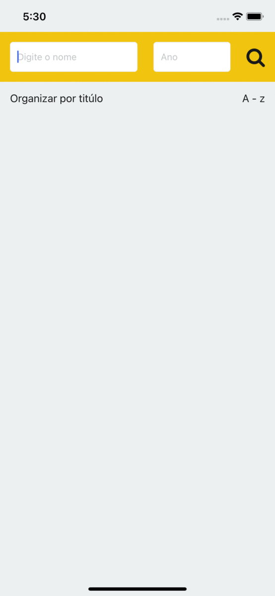

## Dev

Nome: Iago Dias
E-mail: iago.unama@hotmail.com

## Demo



## Bibliotecas

- React Native
- Styled component;
- Redux;
- Redux Sauce;
- Redux Saga;
- TypScript;


## Instrução para rodar

Após o ambiente react native configurado ([Instruções](https://reactnative.dev/docs/next/environment-setup "Instruções")) escolha qual plataforma você queira compilar.

Primeiramente vamos instalar todas nossas dependencias, rode o seguinte comando na raiz do projeto:

```sh
yarn
```

####iOS
Para compilar iOs você precisa dos seguintes comandos:

 Dentro da pasta ios:
 ```sh
pod install
```


Na raiz do projeto:

 ```sh
react-native run-ios
```


####Android
Para compilar Android você precisa do seguinte comando:

Na raiz do projeto:

 ```sh
react-native run-android
```

## Funcionalidades do app

- Buscar filmes por título ou ano;
- Ordenar por título ou média de avaliação;
- Ver detalhes do filme;

## Observação

Para rodar o teste utilize o seguinte comando:
 ```sh
yarn test
```


